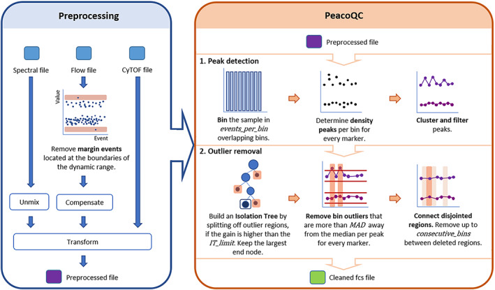
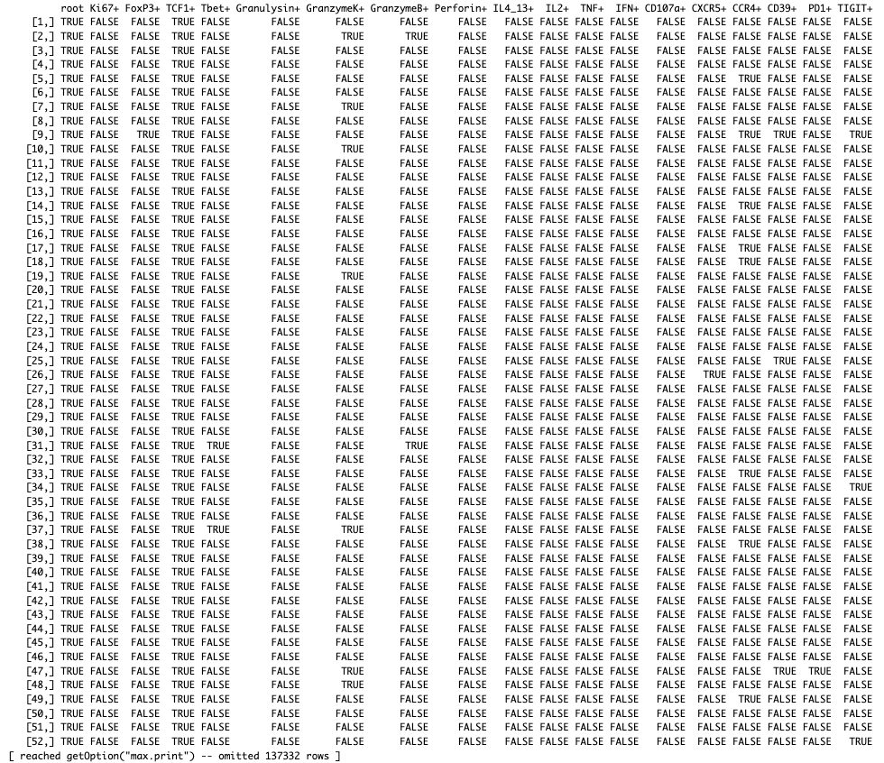
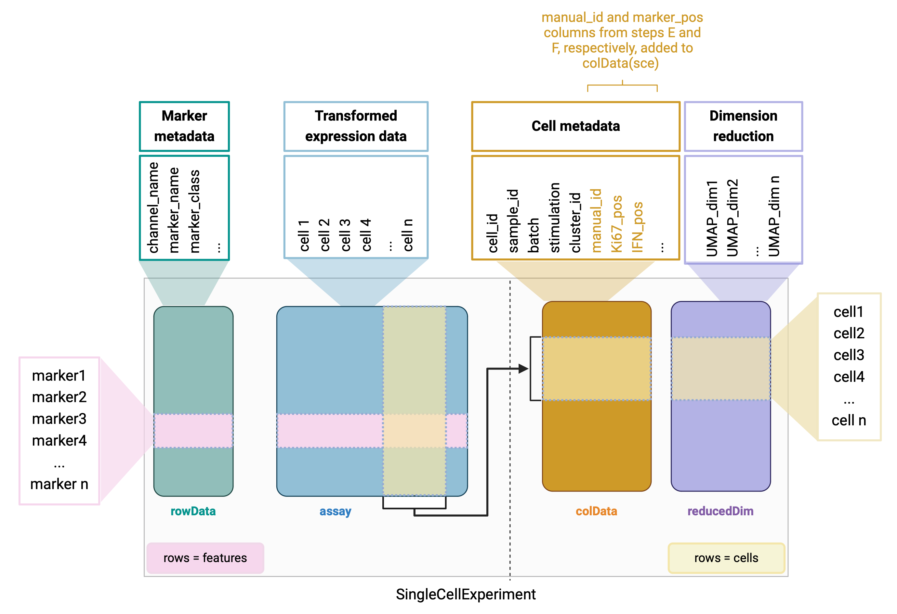
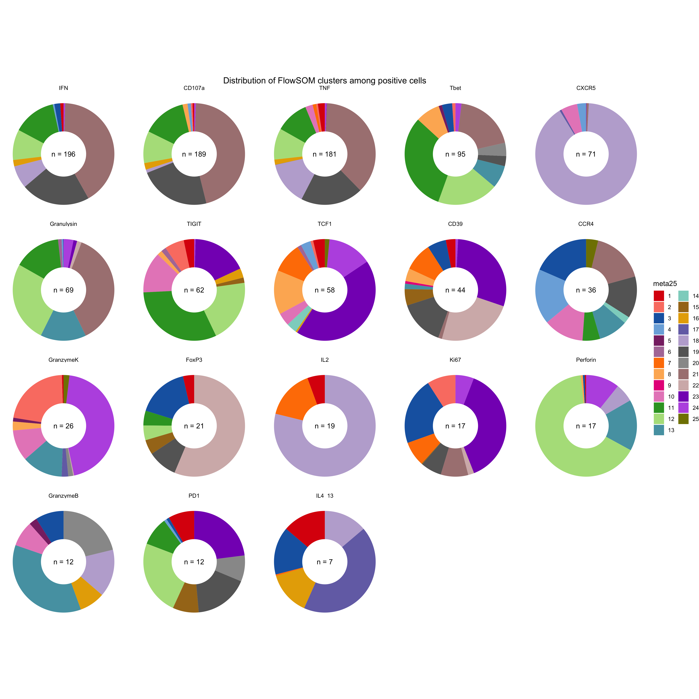

# Spectral flow cytometry-based intracellular cytokine staining

This is a detailed description of the data analysis pipeline for spectral flow cytometry-based intracellular cytokine staining.

## 1) Getting started with GitHub projects

### 1.1) Connect this repository to a local directory

1)  Scroll to the top of this page and click the blue "Code" botton
2)  Copy the link under "Clone with SSH"
3)  Open your terminal and navigate to your local folder where you want to clone the git repository to (using the cd and ls commands)
4)  Type `git clone [copied link from step 2]` → Press enter

You have now cloned the repository to your computer.

Now it's time to open the project in R studio:

### 1.2) Open project in RStudio

5)  Open R studio
6)  Press "File" → "New Project..." → "Existing Directory" → "Browse" → choose the local folder from step 3
7)  Press "Create Project"

You have now opened the project in R studio and are ready to proceed with data analysis.

But first, please read the good practices below to ensure quality and safety:

### 1.3) Good practices

1)  Do **not** share data on GitHub, only code
2)  Do **not** share personal information (e.g. AUID in path to your data files - instead, use relative paths)
3)  To best fulfill point 1 and 2, create a `0_data` folder on your computer which is **not** uploaded to GitHub (add the folder to a `.gitignore` file; see section 1.4)
4)  Follow the core principles below:

**Figure 1: Core principles of project structure for coherent data analysis pipelines**. Created with BioRender.com. Adapted from <https://towardsdatascience.com/how-to-keep-your-research-projects-organized-part-1-folder-structure-10bd56034d3a>

### 1.4) Adding files or folders to `.gitignore` file

1)  In the terminal, navigate to your project folder with the cloned repository from step 3 above (using the cd and ls commands)
2)  Check if you have a .gitignore file by writing `ls -a`
3)  If no .gitignore file is listed, create a .gitignore file by writing `touch .gitignore`, else skip this step
4)  Check the contents of the .gitignore file by writing `cat .gitignore`
5)  If the file/folder you want not to be ignored by Git (i.e. not uploaded) is not present in the .gitignore file, write `echo 'FILENAME/FOLDERNAME' >> .gitignore`
6)  Check contents of the .gitignore file (see step 4) to confirm the filename or foldername was added successfully

Now anything listed in the .gitignore file will be ignored by GitHub and therefore not uploaded.

## 2) Data analysis

Below is a description of the analysis pipeline. The pipeline is inspired by:

-   *den Braanker H, Bongenaar M and Lubberts E (2021) How to Prepare Spectral Flow Cytometry Datasets for High Dimensional Data Analysis: A Practical Workflow. Front. Immunol. 12:768113. doi: 10.3389/fimmu.2021.768113*

-   *Van Gassen S, Callebaut B, Van Helden M, Lambrecht B, Demeester P, Dhaene T, Saeys Y (2015). “FlowSOM: Using self-organizing maps for visualization and interpretation of cytometry data.” Cytometry Part A, 87(7), 636-645. <https://onlinelibrary.wiley.com/doi/full/10.1002/cyto.a.22625>.*

**Figure 2: Overview of data analysis**

### Install packages

**File to use**: `1_scripts/install_packages.R`

If you have never run spectral flow cytometry data analysis on your device before, you need to install some of the most essential R packages through **BiocManager**, **devtools** and **remote**. To do so, use the **install_packages.R** script. For installation of conventional R packages from a repository, use the `install.packages()` function.

### Step A: Load data

**File to use**: `1_scripts/1_load_transform.Rmd`

The first step of data analysis is importing the unmixed FCS files into R. The **flowCore** package provides basic structures for working with flow cytometry data in R and imports FCS files as a **flowSet**. A flowSet is a class for storing flow cytometry raw data from quantitative cell-based assays (i.e., data from multiple .fcs files). A flowSet consist of one or more **flowFrames**. A flowFrame is a class for storing observed quantitative properties for a population of cells from a FACS run (i.e., data from one .fcs file). There are three parts of the data in a flowFrame:

1.  A numeric matrix of the raw measurements with rows=events and columns=parameters
2.  Annotation for the parameters (e.g., measurement channels, stains, dynamic range)
3.  Additional annotation provided through keywords in the .fcs file

**Figure 3: Import FCS files as a flowSet in RStudio**. Created with BioRender.com. Adapted from <https://bmcbioinformatics.biomedcentral.com/articles/10.1186/1471-2105-10-106>.

### Step B: Data transformation

**File to use**: `1_scripts/1_load_transform.Rmd`

As the physical process of exciting, emitting and detecting fluorescence signals on a flow cytometer results in increased variance of fluorescence signal when mean fluorescence intensity increases (signal variance is inhomogenous), transformation of data is needed to stabilise the variance. Data is transformed using *logicle transformation* from the **flowWorkspace** package.

Below are all markers before and after transformation:

### Step C: Pregating

**File to use**: `1_scripts/2_pregate.R`

The second step of data analysis is pregating. Here cells are gated for lymphocytes → single cells → live cells → dump- cells → CD19-CD13+ cells:

Gating is done using the **CytoExploreR** package with interactive pop-up windows to draw you gates. CytoExploreR needs a **gatingSet** object as input, which can be created directly from the transformed flowSet. Drawn gates are saved in a **gatingTemplate** (a csv file containing information on parent population, gate name, gate coordinates, etc.) which can be reused on other samples.

After gating, the end gate population is saved as a flowSet and used for downstream analysis.

### Step D: Quality control

**File to use**: `1_scripts/3_qualitycontrol.R`

Automatic quality control is performed using the **PeacoQC** package for removal of low-quality events, e.g.

-   Temporary shift in signal (clogs/slow uptake)
-   Permanent shift in signal (speed/flow rate change)
-   Monotonic decrease in signal (contamination)
-   Monotonic increase in signal (contamination)

An overview of the PeacoQC algorithm is shown below:

**Figure 4: Chart of the PeacoQC algorithm**. From: <https://pubmed.ncbi.nlm.nih.gov/34549881/>.

For each file, a report is created:

The report shows events sorted by acquisition time and the signal for each marker. Removed events are highlighted in color codes based on which part of the algorithm decided to remove it. The PeacoQC algorithm creates QC fcs files, which can be read back into RStudio as a flowSet for downstream analysis.

### Step E: Gate cell types

**File to use**: `1_scripts/4_gateCellTypes.Rmd`

Manual gating to identify T cell subsets is done using CytoExploreR. A GatingSet is created from the QC flowSet and events are gated using the markers CD4, CD8, CD45RA, CCR7, CD27, CD95, and FoxP3.

The gating strategy is shown below:

The cell labels obtained from manual gating can be converted into a **vector of cell labels** using the `q_Gating_matrix_vector` function in the `0_source` file. This is a wrapper function based on the `FlowSOM::GetFlowJoLabels` function. The resulting vector can be added to colData(sce) in the script `6_dimred_clustering` for visualization of manual cell labels on a UMAP.

### Step F: Gate marker positivity

**File to use**: `1_scripts/5_gateMarkers.R`

Gates for marker positivity are drawn using CytoExploreR. A gatingSet is again created from the QC flowSet and events are gated for positivity of the markers Ki67, FoxP3, TCF1, Tbet, Granulysin, Granzyme K, Granzyme B, Perforin, IL4_IL13, IL2, TNF, IFN, CD107a, CXCR5, CCR4, CD39, PD1, TIGIT.

Below is an example of the gate for IFN faceted by stimulation:

Using the function `q_Gating_matrix_vector` we can get a **boolean matrix of TRUE/FALSE for marker positivity** for all cells in the flowSet/gatingSet. This matrix can later be added to colData(sce) in the script `6_dimred_clustering` for visualization of marker positivity on a UMAP.

The matrix looks like this:

### Step G: Clustering and dimensionality reduction

**File to use**: `1_scripts/6_dimred_clustering.Rmd`

To cluster and reduce the dimensions of our flowSet, we first need to convert it to a Single Cell Experiment (SCE). This is done with the `prep_data` function from **CATALYST**. The architecture of a SCE is shown below:

**Figure 5: SCE** Created in BioRender.com. Adapted from: <https://bioconductor.org/books/3.14/OSCA.intro/the-singlecellexperiment-class.html>.

In colData(sce), the columns **manual_id** and **IFN_pos** are highlighted in light yellow. These are the results of steps E and F.

FlowSOM clustering and dimensionality reduction (UMAP) of the data is done with the `cluster` function and `runDR` functions from **CATALYST**. Afterwards, FlowSOM clusters, manual cell labels or marker positivity can be plotted on the UMAP using the `plotDR` function from **CATALYST**:

 

#### Bulk metacluster subraction of background (NEG) from signal (Gag) for each marker

For subtraction of background signal to obtain the real signal from Gag stimulated cells, the function `q_ICSsfcm_GatingMarkers_BackgroundSub_BulkClust` is used. In short, this function takes the boolean matrix from step F and the FlowSOM cluster labels from step E and calculates a percentage of positive cells for all gated markers per FlowSOM metacluster. Then, the percentage of positive cells from negative stimulation (NEG) is subtracted from the corresponding signal (same metacluster, same marker) from Gag stimulated condition to get the bulk background subtracted value for each marker within each metacluster.

The function performs the following calculations:

1)  Pivot boolean matrix longer

`df_long = df %>% pivot_longer(cols = -c(metacluster, stimulation), names_to = "marker", values_to = "pos")`

2)  Group by metacluster, stimulation, and marker to count number of positive cells per metacluster and stimulation for each marker

`counts_pos = df_long %>% group_by(metacluster, stimulation,marker) %>% summarise(n_pos = sum(pos))`

3)  Get metacluster sizes per stimulation

`cluster_sizes = df %>% group_by(metacluster,stimulation) %>% tally()`

4)  Combine the results of step 2 and 3 to one dataframe

`df_counts = counts_pos %>% right_join(cluster_sizes, by=c(metalevel,stimulation))`

5)  Calculate percentage of positive cells by dividing number of positive cells with number of cells in cluster

`df_counts$perc_pos = (df_counts$n_pos/df_counts$n)*100`

6)  For each cluster and marker, subtract the percentage from corresponding negative stimulation (i.e. subtracting bacground for each marker in the corresponding cluster)

`df_final = df_counts %>% group_by(metacluster) %>% mutate(perc_pos_backgroundsubtracted = perc_pos - perc_pos[stimulation == "NEG"])`

7)  Remove all background values from the dataframe

`df_final = df_final[df_final[stimulation]!="NEG",]`

8)  Convert the background subtracted percentage of positive cells back to a number of positive cells by multipying by cluster size

`df_final$n_pos_backgroundsubtracted = (df_final$perc_pos_backgroundsubtracted/100)*df_final\$n`

9)  Set negative values to zero:

`df_final$n_pos_backgroundsubtracted = pmax(df_final$n_pos_backgroundsubtracted,0)`

Below is a plot of the final result showing the distribution of positive cells across FlowSOM cluster with the total number of positive cells in the middle of each pie chart:

